[](https://infrati.dev)

## 📋 infratidev

### Terraform Cloud CLI-driven workflow

O uso do Terraform Cloud por meio da linha de comando é chamado ***Terraform Cloud CLI-driven workflow***. Quando você usa o CLI-driven workflow, operações como terraform plan ou terraform apply são executadas remotamente no ambiente do Terraform Cloud por padrão, o output das operações são exibidas tanto na UI quando no terminal local.

#### Requirements

* Conta criada na HCP
  * Link para criação da conta: [Criação da conta](https://app.terraform.io/session), testes realizados utilizando o plano gratuito: [Free Plan](https://app.terraform.io/app/andrei/settings/billing/plans)
* API token criado na HCP. [Link documentação](https://developer.hashicorp.com/terraform/cloud-docs/users-teams-organizations/users#api-tokens)
* AWS_SECRET_ACCESS_KEY e AWS_ACCESS_KEY_ID gerados na AWS e configurados no HCP em [variáveis de ambiente](https://developer.hashicorp.com/terraform/language/values/variables#environment-variables) aplicadas como [sensíveis](https://developer.hashicorp.com/terraform/cloud-docs/workspaces/variables/managing-variables#sensitive-values) dentro do workspace.
* Organização e workspaces criadas na HPC.
  * Nesse exemplo o nome da organização é: ```andrei```
  * Workspace criada:
    * terraform-cloud-aws-cli

#### Estrutura do terraform provisionada para exemplo. 

Criação de três servidores web em três zonas de disponibilidade ```[us-east-1a,us-east-1b,us-east-1c]```, com domínio próprio ```infracode.sres.dev ```configurado no Route53 direcionando as requisições para o ALB (Application Load Balancer) utilizando TLS nas requisições entre usuário e o alb. Nesse exemplo, os três servidores estão em subnets públicas com EIP alocados.

~~~
.
├── acm.tf
├── alb.tf
├── data.tf
├── ec2.tf
├── network.tf
├── output.tf
├── provider.tf
├── route53.tf
├── sg.tf
└── variables.tf
~~~

Configuração do remote backend

~~~
  cloud {
    organization = "andrei"

    workspaces {
      name = "terraform-cloud-aws-cli"
    }
  }
~~~

### Execuções

Primeiro passo é ter as credenciais cadastradas do HCP na máquina.

Fazer o login através do comando: `terraform login`

Ou podemos criar no caso do linux no diretorio home do usuario o arquivo `.terraformrc` informando o token como no exemplo abaixo. [Link documentação para  o processo manual](https://developer.hashicorp.com/terraform/cli/config/config-file#credentials)

~~~
credentials "app.terraform.io" {
  token = "xxxxxx.atlasv1.zzzzzzzzzzzzz"
}
~~~

Através do `terraform login` as credenciais ficam armazenadas no diretorio home do usuário:

~~~
cat ~/.terraform.d/credentials.tfrc.json
~~~

Na forma da estrutura abaixo:

~~~
{
  "credentials": {
    "app.terraform.io": {
      "token": "xxxxxx.atlasv1.zzzzzzzzzzzzz"
    }
  }
}
~~~

#### Inicializando o workspace
`terraform init`

Output do comando:

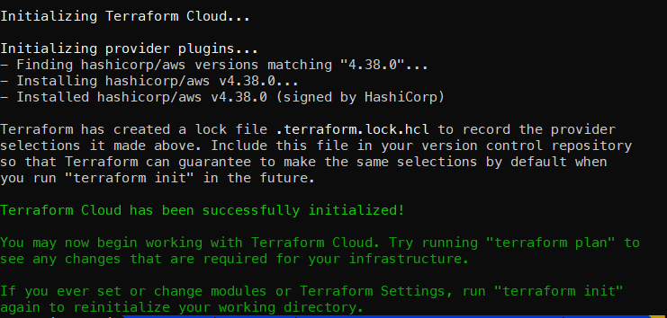

#### Apply para iniciar a primeira execução no workspace
`terraform apply`

Ao aplicar o apply, na HCP é iniciado o plan conforme na imagem abaixo.

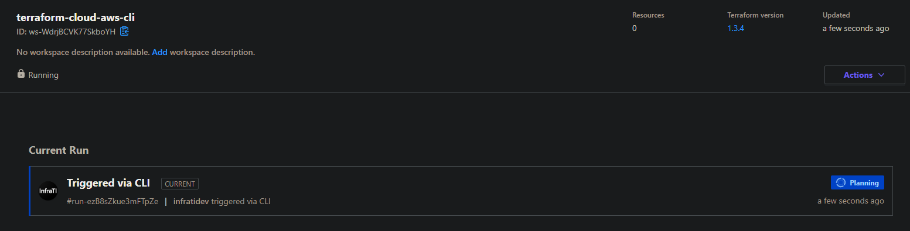
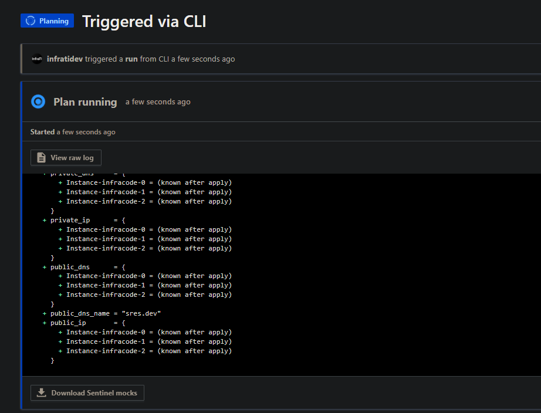

`plan` finalizado

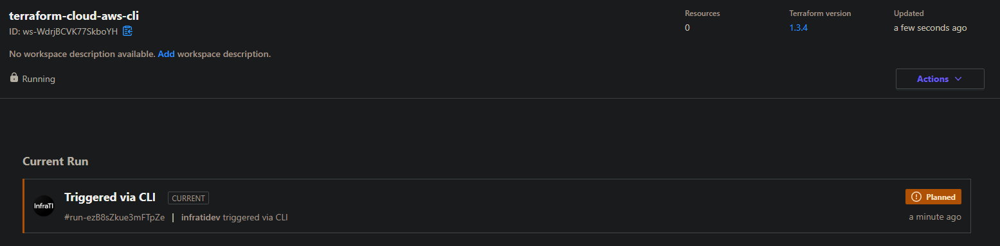

Finalizado o `plan`, inicia-se o `apply` podendo ser manual ou automático. No caso do exemplo foi feito o ```apply``` manual.

Aprovando ```apply```


```apply``` em execução

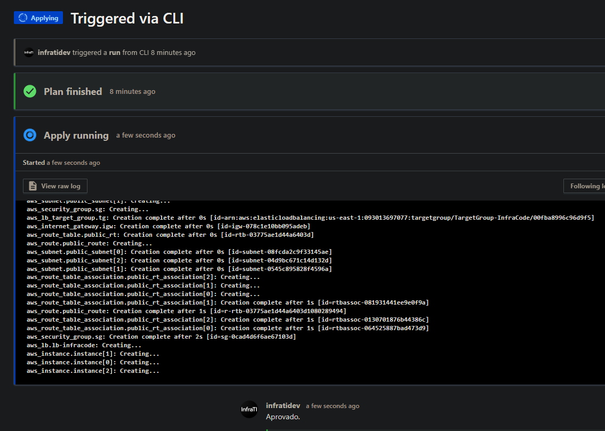

Imagem abaixo mostra a execução bem sucedida do `terraform plan` e `terraform apply`

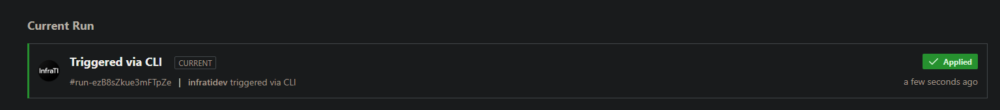
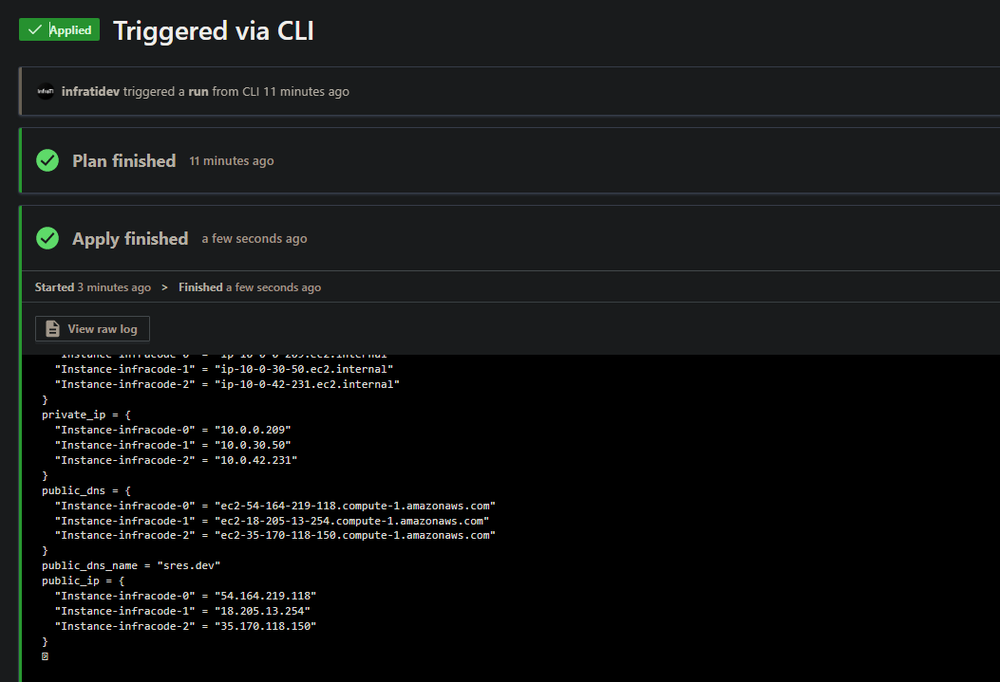


State File na HCP e versionado

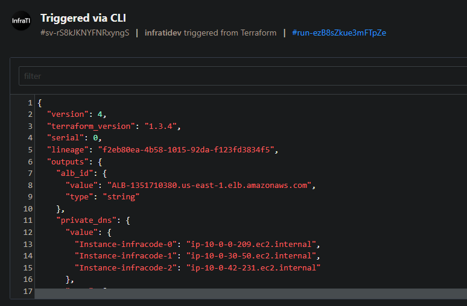

### Estrutura provisionada com sucesso!!!

ALB criado:

~~~
"ALB-1351710380.us-east-1.elb.amazonaws.com"
~~~

Endereços de cada instancia nas zonas de disponibilidades.

~~~
"Instance-infracode-0" = "54.164.219.118"
"Instance-infracode-1" = "18.205.13.254"
"Instance-infracode-2" = "35.170.118.150"
~~~

Realizando algumas requisições para o fqdn criado, validando o direcionamento para o ALB no route53.

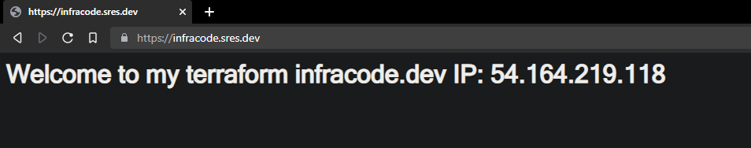
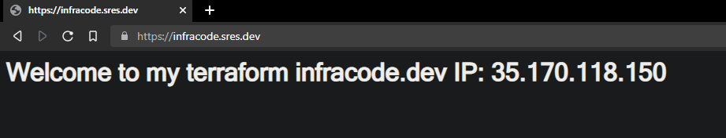
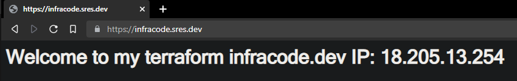

Caso necessite realizar a remoção dos recursos. Dentro das configurações do workspace, existe a opção ```Destruction and Deletion```.

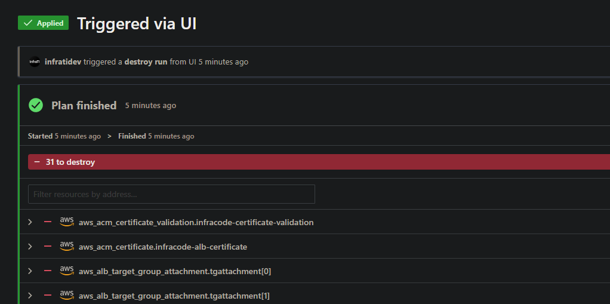
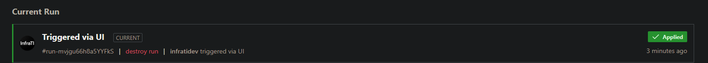

Estrutura removida com sucesso!!

<br>

[](https://infrati.dev)


