[](https://infrati.dev)

## 📋 infratidev
 
### Terraform Cloud Control Version Workflow

O uso do Terraform Cloud integrado com o Github ***Terraform Cloud Version Control workflow***.

#### Requirements

* Conta criada na HCP
  * Link para criação da conta: [Criação da conta](https://app.terraform.io/session), testes realizados utilizando o plano gratuito: [Free Plan](https://app.terraform.io/app/andrei/settings/billing/plans)
* API token criado na HCP. [Link documentação](https://developer.hashicorp.com/terraform/cloud-docs/users-teams-organizations/users#api-tokens)
* AWS_SECRET_ACCESS_KEY e AWS_ACCESS_KEY_ID gerados na AWS e configurados no HCP em [variáveis de ambiente](https://developer.hashicorp.com/terraform/language/values/variables#environment-variables) aplicadas como [sensíveis](https://developer.hashicorp.com/terraform/cloud-docs/workspaces/variables/managing-variables#sensitive-values) dentro do workspace.
* Organização e workspaces criadas na HPC.
  * Nesse exemplo o nome da organização é: ```andrei```
  * Workspace criada:
    * terraform-cloud-aws-github

#### Estrutura do terraform provisionada para exemplo. 

Criação de três servidores web em três zonas de disponibilidade ```[us-east-1a,us-east-1b,us-east-1c]```, com domínio próprio ```infracode.sres.dev ```configurado no Route53 direcionando as requisições para o ALB (Application Load Balancer) utilizando TLS nas requisições entre usuário e o alb. Nesse exemplo, os três servidores estão em subnets públicas com EIP alocados.

~~~
.
├── acm.tf
├── alb.tf
├── data.tf
├── ec2.tf
├── network.tf
├── output.tf
├── provider.tf
├── route53.tf
├── sg.tf
└── variables.tf
~~~

Configuração do remote backend

~~~
  cloud {
    organization = "andrei"

    workspaces {
      name = "terraform-cloud-aws-github"
    }
  }
~~~

### Execuções

#### Ao abrir um PR no github com a opção (Speculative Plans) habilitado no terraform cloud, automaticamente é realizado um `plan` para testar as alterações durante o pull request.

**Obs:** Speculative Plans não aparecem na lista de execuções no workspace

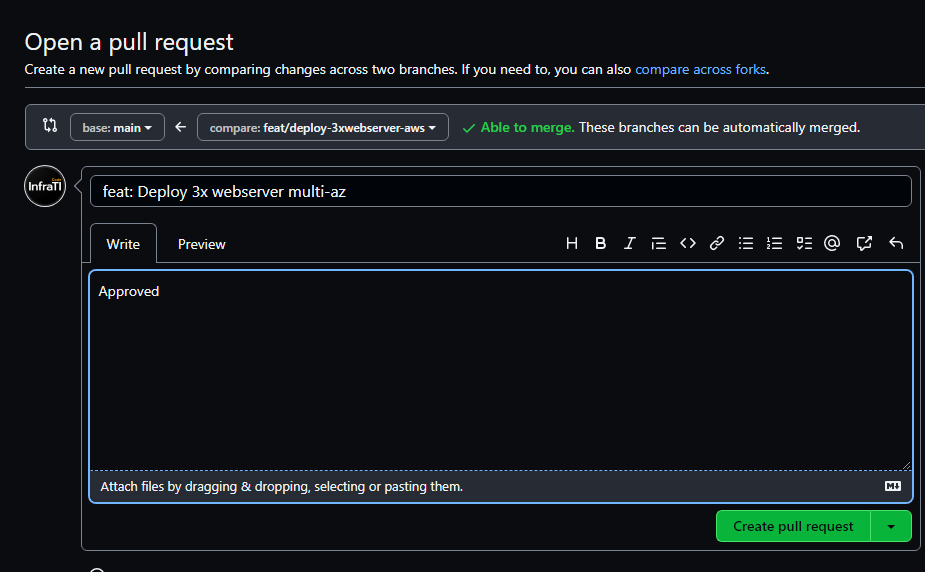

`plan` em execução durante a abertura do PR

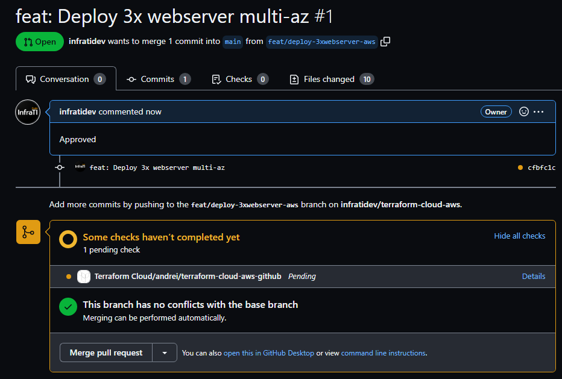

`plan` executado com sucesso

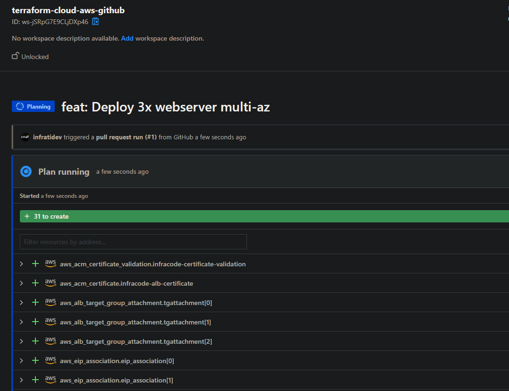
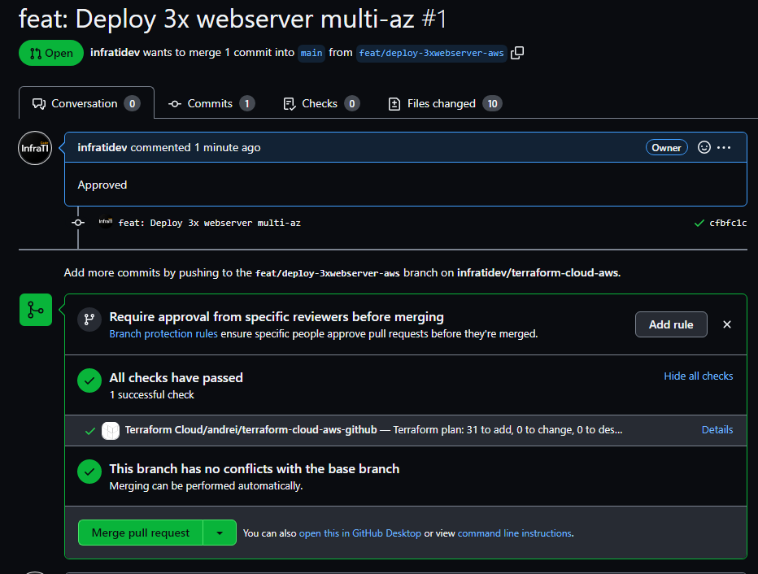


PR aprovado o merge é realizado na main.

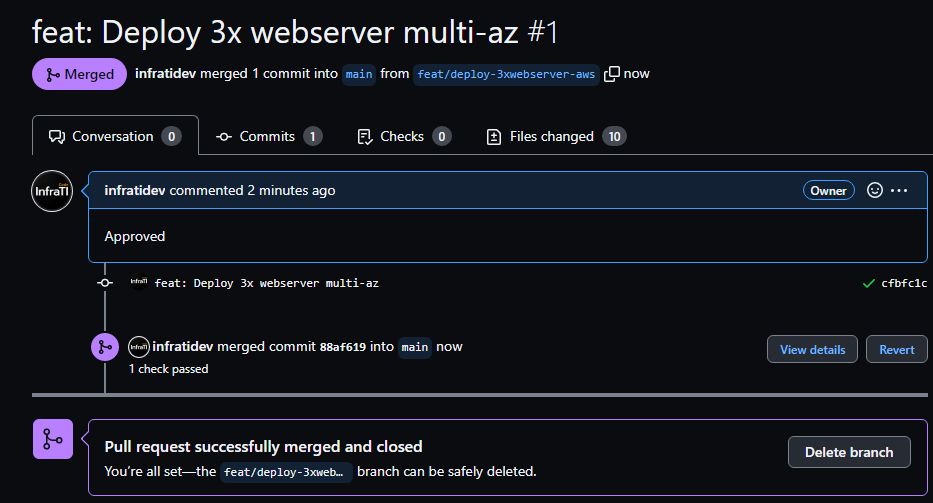

Ao realizar o merge na `main` o `plan` entra em execução novamente no HCP.

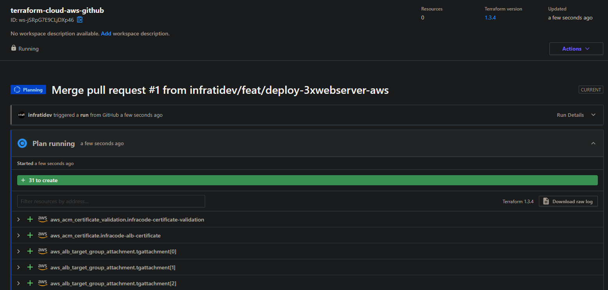

`plan` executado com sucesso

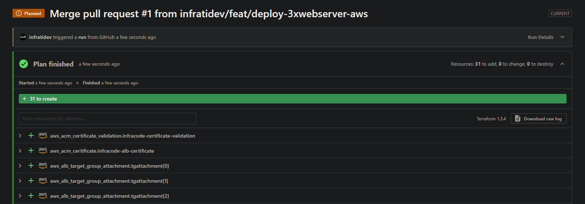

Aprovação do `apply` manualmente nesse caso, pode ser automático também.

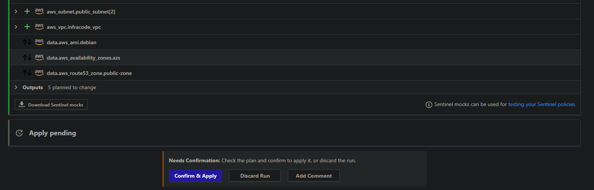

`apply` em execução

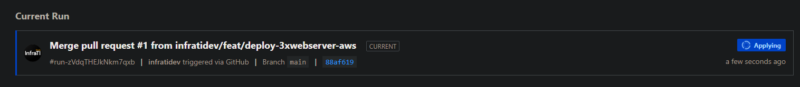
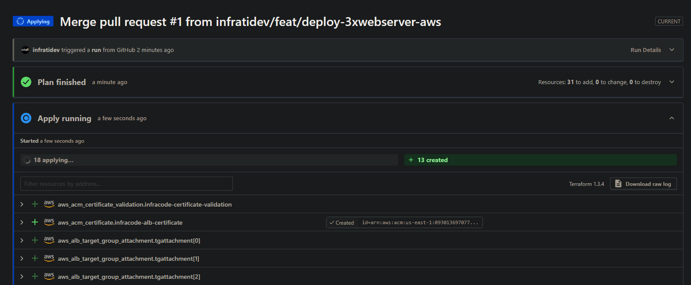

`apply` executado com sucesso

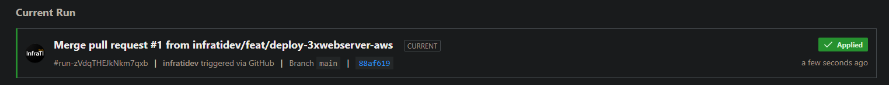
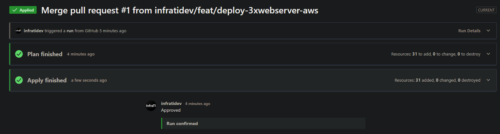

output gerado do terraform

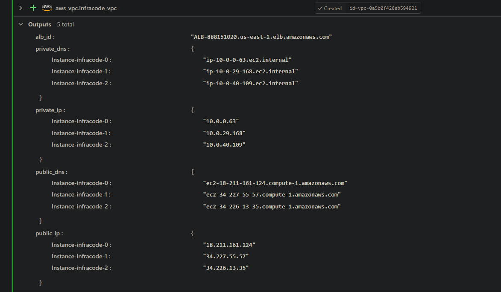

### Estrutura provisionada com sucesso!!!

ALB criado:

~~~
"ALB-888151020.us-east-1.elb.amazonaws.com"
~~~

Endereços de cada instancia nas zonas de disponibilidades.

~~~
"Instance-infracode-0" = "18.211.161.124"
"Instance-infracode-1" = "34.227.55.57"
"Instance-infracode-2" = "34.226.13.35"
~~~

Realizando algumas requisições para o fqdn criado, validando o direcionamento para o ALB no route53.

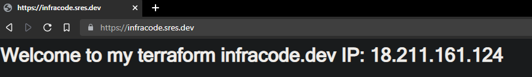
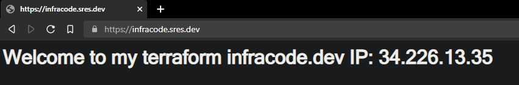
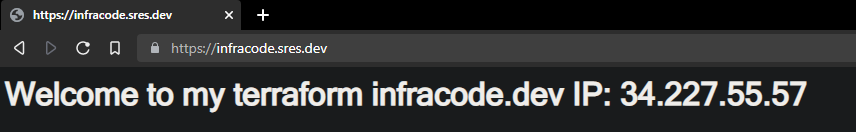

Caso necessite realizar a remoção dos recursos. Dentro das configurações do workspace, existe a opção ```Destruction and Deletion```.

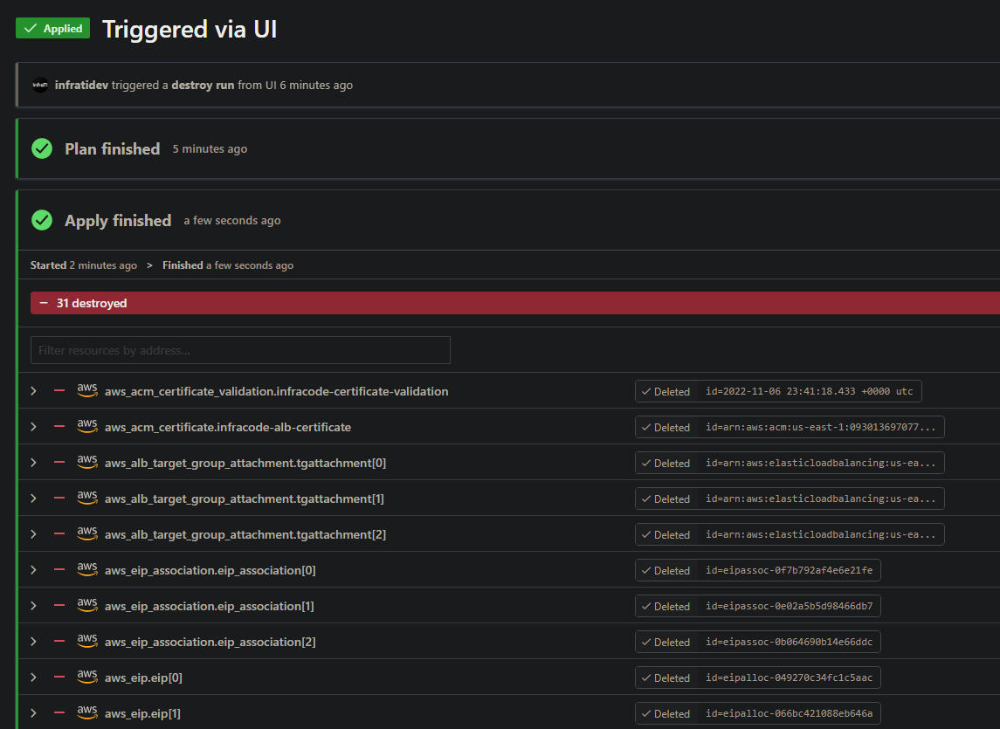

Estrutura removida com sucesso!!

<br>

[](https://infrati.dev)


